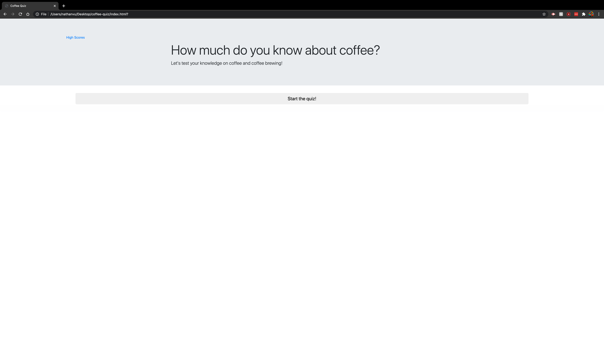
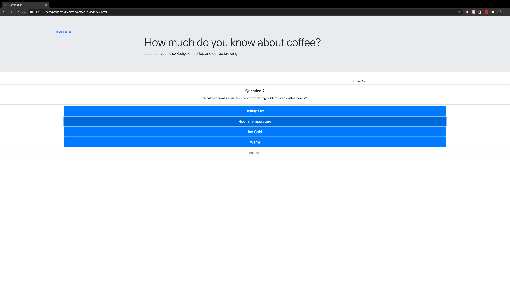
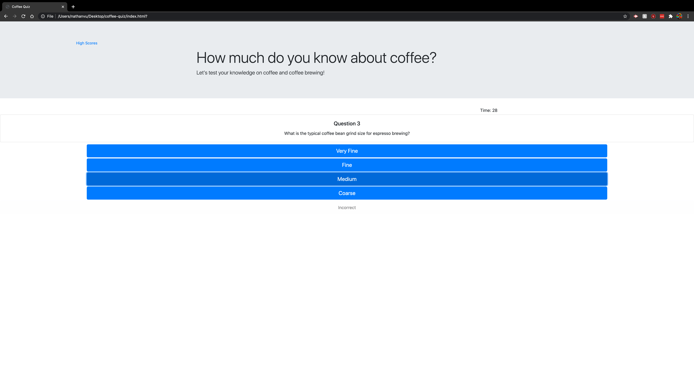
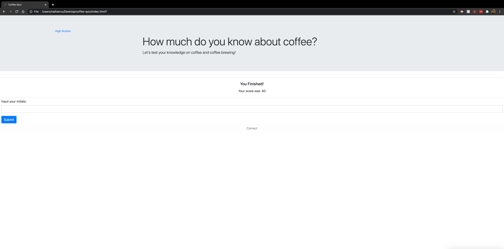
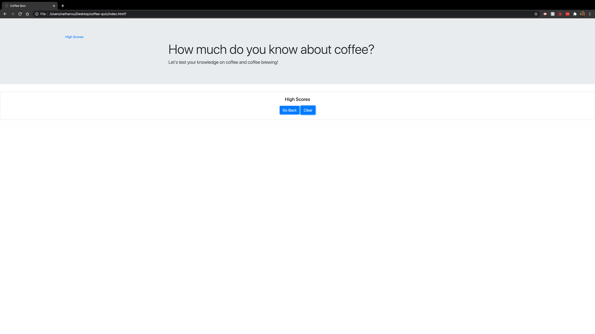
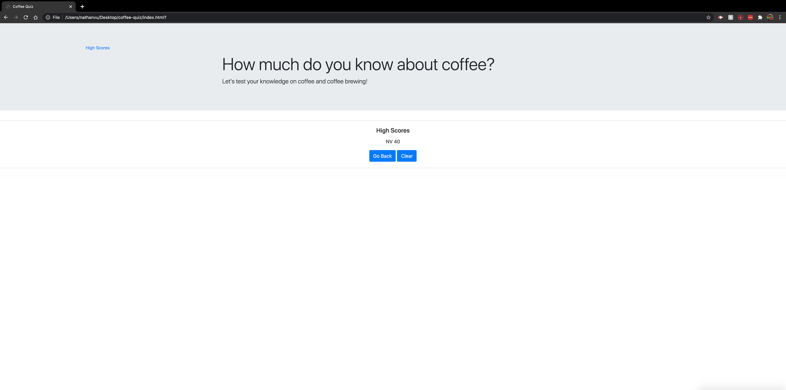

# Coffee-Quiz

## Description

This is a quiz that briefly tests you on your knowledge of coffee and coffee brewing. It utilizes mainly Javascript in order to handle user inputs while the page elements are set up with HTML and CSS using the Bootstrap library.

## Getting Started

* [Github Repository](https://github.com/nathanmvu/password-generator)
* [Deployed Link](https://nathanmvu.github.io/coffee-quiz/)
* [Usage Demo Video](https://drive.google.com/file/d/1G4CenNWlmtvzXj0OROpieNdSVHWqRdum/view)

### Usage

The quiz starts with a start button to begin the quiz which will also start the timer. There are only 4 questions with 4 answer choices each as well as a timer which initially allows 60 seconds to answer the quiz. Each correct answer adds 20 points to your score and each wrong answer decreases your score by 8 points unless your score is below 8. At the end of the quiz, the user can enter their initial which will get logged with the score onto the high scores list. After submitting the score, the user can click the back button to return to the start screen or the clear button to clear the high scores list. Clicking the highscore button at any point during the quiz will take the user to the high scores page which shows all the scores recorded from taking the quiz in that local instance.

### Screenshots

Start Screen:

First Question:

Second Question:

Highscore Input Screen:

Empty Highscores List:

Inputted Highscore:

## Author

* **Nathan Vu** - [Github Profile](https://github.com/nathanmvu)

## Acknowledgments

* Project parameters provided by the UCB Extension Coding Bootcamp

## License

This project is licensed under the MIT License 

